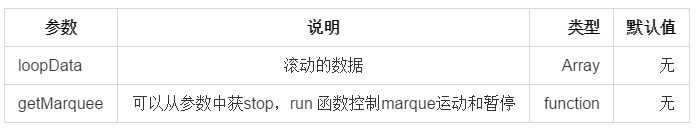

Usage

---------------

安装
````javascript
npm install --save react-marquee
````

<<<<<<< HEAD
=======
组件
````javascript
<Marquee loopData={loopData} getMarquee={this.getMarquee}/>
````
>>>>>>> 26c5d3f63569dbddde597ab687df1689918d3af1

Examples

---------------

````javascript
    
import Marquee from 'react-marquee'

class MarqueePage extends Component {
    constructor(props, context) {
        super(props, context);
        this.state = {
            loop: false,
            loopData: [
                { txt: "这是一条数据1" }, 
                { txt: "这是一条数据2" }, 
                { txt: "这是一条数据3" }, 
                { txt: "这是一条数据4" }
            ]
        }
    }
    render() {
        let { loop, loopData } = this.state;
        return (
            <div>
                <div className="box">
                    <Marquee loopData={loopData} getMarquee={this.getMarquee} />
                </div>
                <div className="botton" onClick={this.runMarquee}>运动</div>
                <div className="botton" onClick={this.stopMarquee}>暂停</div>
            </div>
        )
    }

    getMarquee = (params) => {
        this.marqueeParams = params
    }

    stopMarquee = () => {
        this.marqueeParams.stopMarquee();
    }

    runMarquee = () => {
        this.marqueeParams.runMarquee();
    }

}
````


Api
<<<<<<< HEAD
----


=======

----

参数 | 说明 | 类型 | 默认值 
- | :-: | -: | -: |
>>>>>>> 62e6caf7a5e0bebfe2db94c0ebdb5d894434d44a
loopData | 滚动的数据 | Array  |  无
getMarquee | 可以从参数中获stop，run 函数控制marque运动和暂停 |  function | 无
>>>>>>> 26c5d3f63569dbddde597ab687df1689918d3af1
